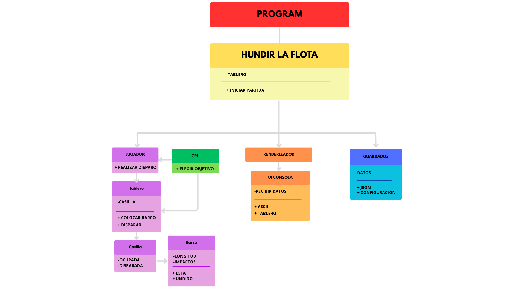

# Proyecto Hundir la Flota

## Diseño del Sistema (UML)

El diseño se basa en una arquitectura de capas, separando la lógica de **Dominio** (reglas puras) de la **Presentación** (consola).

## Reglas del Juego
1. **Dimensiones:** Tablero de 10x10 casillas (A1-J10).
2. **Adyacencia Estricta:** No se pueden colocar barcos pegados a otros, ni siquiera en **diagonal**. Debe haber al menos una casilla de agua de separación.
3. **Turnos:** Juego por turnos alternos entre Humano y CPU.
4. **Sin Repetición:** No se permite disparar dos veces a la misma coordenada.

## Composición de la Flota
Cada jugador cuenta con 5 embarcaciones:
| Tipo de Barco  | Tamaño | Cantidad |
| :---           | :---:  | :---:    |
| Portaaviones   | 5      | 1        |
| Acorazado      | 4      | 1        |
| Destructor     | 3      | 1        |
| Submarino      | 3      | 1        |
| Patrullera     | 2      | 1        |

## Mecánicas
- **Colocación:** Fase inicial donde se posicionan los barcos (Manual para humano, Aleatoria para CPU).
- **Ataque:** Entrada de coordenadas. Los estados posibles son:
    - `~` Agua
    - `X` Impacto
    - `H` Hundido (cuando todas las casillas del barco son impactadas).
- **Victoria:** El primer jugador en reducir a 0 la flota enemiga gana la partida.
